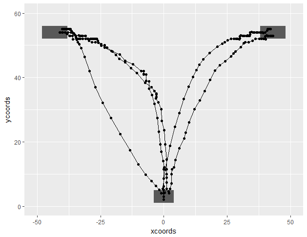

# mousetracking_experiment
Javascript mousetracking experiment and R code for analyses

Experiment structure and analyses are inspired by Freeman and Ambady (2010; https://link.springer.com/content/pdf/10.3758/BRM.42.1.226)

The experiment has been designed on JavaScript using the jsPsych library (https://www.jspsych.org/). Since this experiment is browser based, it can be conveniently used for online experiments (e.g., on MTurk). However, given that online experiments have less controlled environments, reliability might be affected.

The jspsych directory (_jspsych-6.0.4_) includes plugins needed to create a mouse tracking experiment. Code for a sample mousetracking experiment has also been included (_mousetracking.html_)-- other experiments can be adapted from this sample experiment. The _mt_img_ folder includes images for this sample experiment--please download if you want to run the sample experiment! A quick demo of the sample experiment can be found here: https://abcwest.sitehost.iu.edu/mkl/mousetracking/mousetracking.html

By default the experiment tracks mouse-coordinates in a 1000x600 pixel container. These dimensions can easily be altered. The current code is unable to identify the screen dimensions of the user and adapt accordingly.

R code for cleaning data, conducting simple analyses (timenormalizing coordinates, calculating area under the curve), and plotting have been included. Below is an example of mouse trajectory plots resulting from this code. More complex analyses methods can easily be conducting using cleaned mouse trajectory data. A sample data file (_mousetracking_sample_1598874777019.csv_) resulting from this experiment has also been included.

